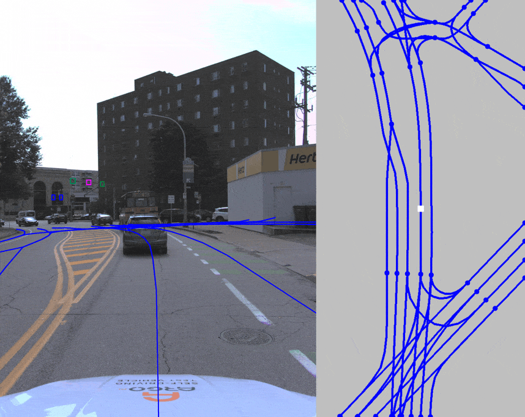
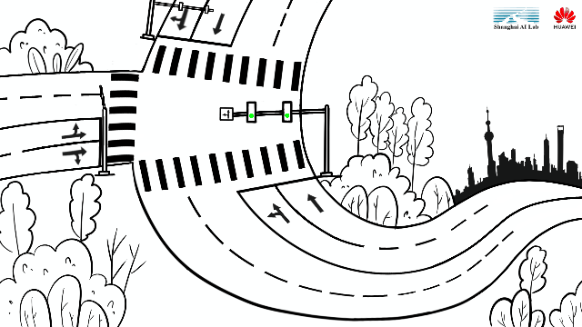
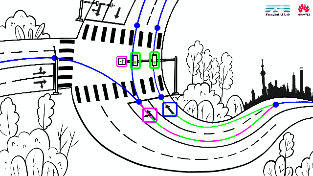

<div id="top" align="center">

# OpenLane-V2
**全球首个自动驾驶道路结构感知和推理基准。**

<a href="#数据">
  
</a>
<a href="#开发工具">
  
</a>
<a href="#引用">
  
</a>
  
**[中文(待定)](./README-zh-hans.md) | [English](./README.md)**
  
*如有不一致，请参阅英文版本。*
  


</div>


## 目录

- [亮点](#亮点---我们与众不同的原因)
- [任务](#任务)
  - [3D车道线检测🛣️](#3d车道线检测-%EF%B8%8F)
  - [交通标志检测🚥](#交通标志检测-)
  - [拓扑认知🕸️](#拓扑认知-%EF%B8%8F)
- [新闻](#新闻)
- [数据](#数据)
- [开发工具](#开发工具)
- [入门指南](#入门指南)
- [基准和排行榜](#基准和排行榜)
- [引用](#引用)
- [许可](#许可)

## 亮点 - 我们与众不同的原因
### $\color{Magenta}\fcolorbox{white}{white}{三维现实世界，需要3D车道}$ 
现有数据集通常都是在图像上标注车道，但这种 2D 标注不足以满足现实场景的应用。
参考[OpenLane](https://github.com/OpenPerceptionX/OpenLane) 数据集，我们提供  $\color{blue}{3D车道中心线}$ 真值以反映它们在真实环境中的特性。

### $\color{Magenta}\fcolorbox{white}{white}{关注交通信息，识别微小信号}$ 
不仅要防止碰撞，还要提高行车效率。
车辆需要遵循当地的交通规则并与他车交互，以确保安全高效的交通系统。
在路上的  $\color{blue}{交通要素}$ ,例如交通信号灯和道路标志，提供了至关重要且实时的信息。

### $\color{Magenta}\fcolorbox{white}{white}{超越感知任务，融合多元关系}$ 
交通元素仅对其对应的车道有影响。
遵循错误的信号将造成灾难性的后果。
同样地，车道与前继后继车道关联起来构建车辆行驶地图。
自动驾驶汽车需要通过 $\color{blue}{推理}$ 捕捉正确的 $\color{blue}{拓扑关系}$ 来以正确的方式行驶。
我们希望这个数据集的建立可以促进 $\color{blue}{道路场景感知和推理}$ 任务的发展。

### $\color{Magenta}\fcolorbox{white}{white}{多元大量数据，搭建超赞基准}$
对于机器学习，数据是必备的基石。
我们提供从奥斯汀到新加坡，从波士顿到迈阿密等各个城市收集的数据的注释。
$\color{blue}{多元性}$ 数据使模型能够适应不同环境。

<p align="right">(<a href="#top">回到顶部</a>)</p>


## 任务

数据集的首要任务是**场景结构感知和推理**，这需要模型能够识别周围环境中车道的动态可行驶状态。
该数据集的挑战不仅包括检测车道中心线和交通元素，还包括识别交通元素的属性和检测到的对象的拓扑关系。
我们定义了[**OpenLane-V2 Score (OLS)**](./docs/metrics.md#openlane-v2-score)，这是涵盖主要任务不同方面的各种指标的平均值：

$$
OLS = average(mAP_{LC} + mAP_{TE} + mAP_{LCLC} + mAP_{LCTE}).
$$

不同子任务的指标如下所述：

### 3D车道线检测 🛣️

[OpenLane](https://github.com/OpenPerceptionX/OpenLane) 数据集是迄今为止第一个真实世界和规模最大的 3D 车道数据集，提供 3D 空间中的车道线标注。
同样，我们提供 3D 车道中心线并包括 F-Score 以评估无向车道中心线的预测结果。
此外，我们将 3D 车道检测的子任务定义为从覆盖整个水平 FOV(视场角-Field Of View) 的给定多视图图像中检测定向 3D 车道中心线。
平均精度 $mAP_{LC}$ 的实例级评估指标用于测量车道中心线上的检测性能。

<p align="center">
  
</p>

### 交通标志检测 🚥

现有的数据集很少关注交通标志的检测及其语义，但是交通标志是自动驾驶汽车中关键信息。
该属性表示交通元素的语义，例如交通灯的红色。
在这个子任务中，在给定的前视图图像上，要求同时感知交通元素（交通灯和路标）的位置及其属性。
与典型的 2D 检测数据集相比，挑战在于由于室外环境的大规模，交通元素的大小很小。
与典型的 2D 检测任务类似，
$mAP_{TE}$ 的度量用于衡量在不同属性上平均的交通元素 (TE) 检测的性能。


<p align="center">
  
</p>


### 拓扑认知 🕸️
我们首先定义在自动驾驶领域识别拓扑关系的任务。
给定多视图图像，该模型学习识别车道中心线之间以及车道中心线与交通元素之间的拓扑关系。
最相似的任务是图领域的连通性预测，其中顶点是给定的，模型只预测边。
在我们的例子中，模型的顶点和边都是未知的。
因此，首先需要检测车道中心线和交通要素，然后建立拓扑关系。
参考连通性预测任务，
$mAP_{LCLC}$用于车道中心线（LCLC）之间的拓扑，
$mAP_{LCTE}$ 用于车道中心线和交通元素（LCTE）之间的拓扑。

<p align="center">
  
</p>

<p align="right">(<a href="#top">回到顶部</a>)</p>


## 新闻
- [2023/01]
  * 数据集 v0.1： OpenLane-V2 [数据集样本](data/OpenLane-V2/dataset-sample/)。
  * 开发工具 v0.1： OpenLane-V2 开发工具。

<p align="right">(<a href="#top">回到顶部</a>)</p>


## 数据

OpenLane-V2 数据集是自动驾驶领域用于道路结构感知和推理的大规模数据集。
参考 [OpenLane](https://github.com/OpenPerceptionX/OpenLane)，我们提供三维空间中的车道真值。
不同的是，我们标注的并不是车道分割线，而是可以作为车辆形式轨迹的车道中心线。
此外，我们还提供了交通要素(交通灯和路标)及其属性的标注，车道中心线之间以及车道中心线与交通要素之间的拓扑关系。

数据集分为两个子集。
**`subset_A`作为主要子集，用于即将到来的挑战和排行榜，比赛中不允许任何外部数据，包括本数据集其他子集**。
`subset_B`可以用来测试模型的泛化能力。
更多详细信息请参考对应页面：[使用数据](./data/README.md)、[标注文档](./docs/annotation.md)与[数据统计](./docs/statistics.md).。

<p align="right">(<a href="#top">回到顶部</a>)</p>


## 开发工具

我们提供了一个开发工具来方便地使用 OpenLane-V2 数据集。
可以通过 `openlanv2` 的API实现数据集的使用，例如加载图像、加载元数据和评估结果。
更多细节请参考[开发工具](./docs/devkit.md)。

<p align="right">(<a href="#top">回到顶部</a>)</p>

## 入门指南

请按照以下步骤熟悉 OpenLane-V2 数据集：

1. 运行以下命令实现数据集搭建并安装必要的工具包：

```sh
git clone https://github.com/OpenDriveLab/OpenLane-V2.git
cd OpenLane-V2
conda create -n openlanev2 python=3.8 -y
conda activate openlanev2
pip install -r requirements.txt
python setup.py install
```

2. 使用[链接](./data/README.md#download)从或下载数据。
然后将它们放入 `data/OpenLane-V2/` 文件夹并解压。
生成的目录为[以下](./data/README.md#hierarchy)结构。
也可以使用这些命令来完成此步骤:

```sh
cd data/OpenLane-V2
wget --load-cookies /tmp/cookies.txt "https://docs.google.com/uc?export=download&confirm=$(wget --quiet --save-cookies /tmp/cookies.txt --keep-session-cookies --no-check-certificate 'https://docs.google.com/uc?export=download&id=1TjcGaHSd1tTMl0rsaxdP_GWnKf2CiDIx' -O- | sed -rn 's/.*confirm=([0-9A-Za-z_]+).*/\1\n/p')&id=1TjcGaHSd1tTMl0rsaxdP_GWnKf2CiDIx" -O OpenLane-V2-subset-A-example.tar
md5sum -c openlanev2.md5
tar -xvf *.tar
cd ../..
```

3. 在 jupyter notebook 上运行 [tutorial](./tutorial.ipynb) 来熟悉数据集与开发工具。


<p align="right">(<a href="#top">回到顶部</a>)</p>


## 基准和排行榜
我们将提供 OpenLane-V2 数据集的初始基准测试，欢迎您在这里添加您的工作!
基准和排行榜将在不久后发布，请持续关注。

| Method | OLS (main metric) | $mAP_{LC}$ | $mAP_{TE}$ | $mAP_{LCLC}$ | $mAP_{LCTE}$ | F-Score* |
| - | - | - | - | - | - | - |
| - | - | - | - | - | - | - |

<sub>*在比赛和排行榜中不考虑 F-Score。
  
<p align="right">(<a href="#top">回到顶部</a>)</p>


## 引用

OpenLane-V2 系上海人工智能实验室的 [OpenDriveLab team](http://opendrivelab.com/) 和华为的 [Noah's Ark Lab](http://dev3.noahlab.com.hk/)] 的共同协作。
当使用 OpenLane-V2 时请引用：
  
```bibtex
@misc{ openlanev2_dataset,
  author = {{OpenLane-V2 Dataset Contributors}},
  title = {{OpenLane-V2: The world's First Perception and Reasoning Benchmark for Scene Structure in Autonomous Driving}},
  url = {https://github.com/OpenDriveLab/OpenLane-V2},
  license = {Apache-2.0},
  year = {2023}
}
```

我们的数据集基于数据集 [NuScenes](https://www.nuscenes.org/nuscenes) 和数据集 [Argoverse](https://www.argoverse.org/av2.html)。如果引用本作，也请同时引用以下工作：
  
```bibtex
@article{ nuscenes2019,
  author = {Holger Caesar and Varun Bankiti and Alex H. Lang and Sourabh Vora and Venice Erin Liong and Qiang Xu and Anush Krishnan and Yu Pan and Giancarlo Baldan and Oscar Beijbom},
  title = {nuScenes: A multimodal dataset for autonomous driving},
  journal = {arXiv preprint arXiv:1903.11027},
  year = {2019}
}

@INPROCEEDINGS { Argoverse2,
  author = {Benjamin Wilson and William Qi and Tanmay Agarwal and John Lambert and Jagjeet Singh and Siddhesh Khandelwal and Bowen Pan and Ratnesh Kumar and Andrew Hartnett and Jhony Kaesemodel Pontes and Deva Ramanan and Peter Carr and James Hays},
  title = {Argoverse 2: Next Generation Datasets for Self-driving Perception and Forecasting},
  booktitle = {Proceedings of the Neural Information Processing Systems Track on Datasets and Benchmarks (NeurIPS Datasets and Benchmarks 2021)},
  year = {2021}
}
```

<p align="right">(<a href="#top">回到顶部</a>)</p>

## 许可
在使用 OpenLane-V2 数据集之前，您应该在网站上注册并同意 [nuScenes](https://www.nuscenes.org/nuscenes) 和 [Argoverse 2](https://www.argoverse.org/av2.html) 数据集的使用条款。
此库中的所有代码都符合 [Apache License 2.0](./LICENSE)。


<p align="right">(<a href="#top">回到顶部</a>)</p>

